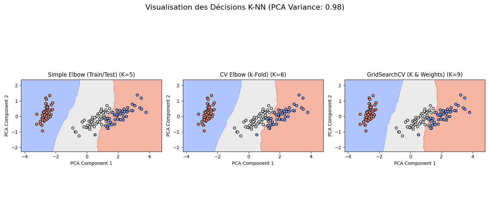
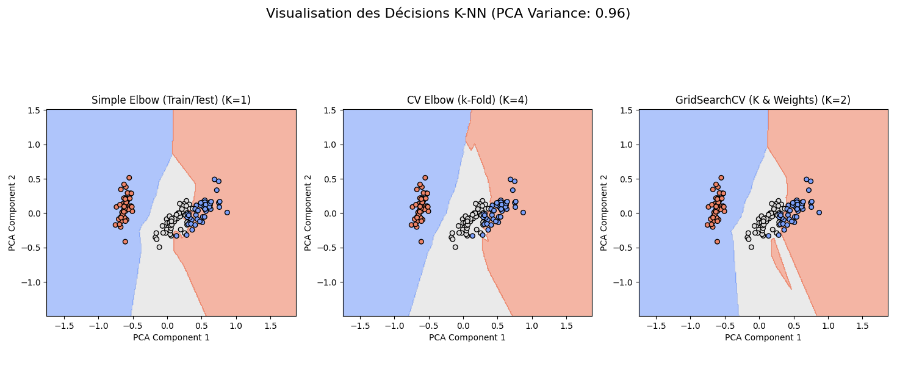
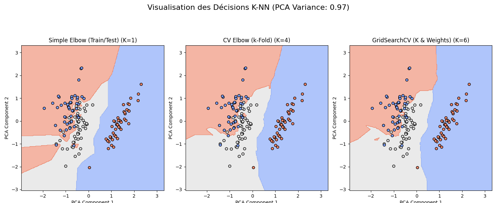

# knnopt: A Python Toolkit for Benchmarking and Visualizing Optimal K in KNN Classification


**knnopt** is a professional-grade Python toolkit designed to automate the selection of the optimal number of neighbors (K) in K-Nearest Neighbors (KNN) classification. It combines robust optimization strategies with intuitive visualizations to help users interpret model behavior across different scalers and configurations.

---

##  Features

- **Automated K Optimization**: Elbow method, Cross-Validation, and GridSearchCV
- **Scaler Benchmarking**: Compare performance across Standard, MinMax, Robust, and raw input
- **PCA-Based Visualization**: Visual storytelling of decision boundaries and cluster separability
- **Unified API**: Simple interface via the `KNNOpt` class
- **Modular Design**: Easily extendable for new optimization methods or scalers
- **Comprehensive Testing**: 21 unit tests ensure reliability and reproducibility

---

##  Installation

### Option 1: Install via PyPI
```bash
pip install knnopt
```

### Option 2: Clone from GitHub

```bash
git clone https://github.com/GuyKaptue/knnopt.git
cd knnopt
pip install -e .
```

### Requirements
- Python 3.8+
- `scikit-learn`
- `pandas`
- `matplotlib`

---

##  Quickstart Example

```python
from sklearn.datasets import load_iris
import pandas as pd
from knnopt.knn_opt import KNNOpt
from knnopt.core.utils import ScalerType

# Load dataset
data = load_iris()
df = pd.DataFrame(data.data, columns=data.feature_names)
df['target'] = data.target

# Run optimization across scalers
for scaler in [ScalerType.NONE, ScalerType.STANDARD, ScalerType.MINMAX, ScalerType.ROBUST]:
    optimizer = KNNOpt(scaler_method=scaler)
    optimizer.run(df=df, target_name='target', test_size=0.3, random_state=42, cv_folds=5, k_max=15)
    print(f"\nScaler: {scaler.name}")
    print(optimizer.get_results())
```

---

##  Visualization

After identifying the optimal K, you can visualize the decision boundaries using PCA:

```python
optimizer.plot_clusters(k=optimal_k, title=f"KNN Clusters at K={optimal_k} (PCA-Reduced)")
```
The following PCA-reduced plot shows how KNN decision boundaries form across three clusters:
**No Scaler**


**StandardScaler**


**MinMaxScaler**


**RobustScaler**


---

##  Project Structure

```
  knnopt/
├── knnopt/                      # Main package directory
│   ├── __init__.py              # Package initialization
│   ├── knn_opt.py               # Main interface class (KNNOpt)
│   └── core/                    # Internal modules for optimization and preprocessing
│       ├── __init__.py          # Core package initialization
│       ├── comparison.py        # Logic for comparing optimization methods
│       ├── optimization.py      # Algorithms for selecting optimal K
│       ├── preprocessing.py     # Feature scaling and data preparation
│       ├── utils.py             # Shared utilities and helper functions
│       └── visualization.py     # PCA-based cluster and boundary visualizations
├── examples/                    # Demo scripts and usage examples
│   ├── demo_knnopt.ipynb        # Interactive Jupyter notebook demo
│   ├── demo_knnopt.py           # CLI-based Python demo script
│   └── figures/                 # Generated visualizations and decision maps
│       ├── knn_clusters.png     # Sample PCA-reduced cluster visualization
│       ├── scaler_comparison.png # Comparison of scalers' decision boundaries
│       └── ...                  # Additional visual outputs
├── tests/                       # Unit tests for all modules
├── LICENSE                      # License file (MIT)
├── MANIFEST.in                  # Package manifest for source distribution
├── pyproject.toml               # Build system and dependency configuration
├── README.md                    # Project documentation and usage guide
├── requirements.txt             # Python dependencies for development
└── setup.cfg                    # Metadata and configuration for packaging

```

---

## Contributing

We welcome contributions! To get started:

1. Fork the repository
2. Create a new branch (`git checkout -b feature-name`)
3. Commit your changes (`git commit -am 'Add new feature'`)
4. Push to your branch (`git push origin feature-name`)
5. Open a pull request

Please ensure all new features include relevant tests.

---

##  Citation

If you use `knnopt` in academic work, please cite the following references:

```bibtex
@article{scikit-learn,
  author    = {Pedregosa, Fabian and Varoquaux, Gaël and Gramfort, Alexandre and Michel, Vincent and Thirion, Bertrand and Grisel, Olivier and Blondel, Mathieu and Prettenhofer, Peter and Weiss, Ron and Dubourg, Vincent and VanderPlas, Jake and Passos, Alexandre and Cournapeau, David and Brucher, Matthieu and Perrot, Matthieu and Duchesnay, Édouard},
  title     = {Scikit-learn: Machine Learning in {Python}},
  journal   = {Journal of Machine Learning Research},
  volume    = {12},
  pages     = {2825--2830},
  year      = {2011},
  url       = {http://jmlr.org/papers/v12/pedregosa11a.html}
}
```

---

##  License

This project is licensed under the MIT License. See the [LICENSE](LICENSE) file for details.

---

##  Links

-  [Documentation](https://github.com/GuyKaptue/knnopt)
-  [Demo Notebook](examples/demo_knnopt.ipynb)
-  [Author](https://github.com/GuyKaptue)


---

### Key Improvements:
1. **Accurate Project Structure**: Reflects your actual directory layout.
2. **Clear Installation Instructions**: Includes both PyPI and GitHub installation options.
3. **Detailed Quickstart Example**: Shows how to use the `KNNOpt` class with different scalers.
4. **Visualization Example**: Demonstrates how to plot clusters using PCA.
5. **Comprehensive Contribution Guidelines**: Encourages community involvement.
6. **Citation and License Information**: Provides proper attribution and licensing details.

